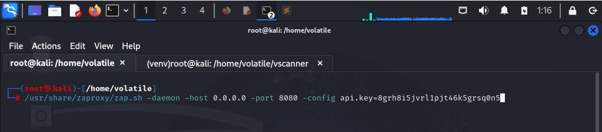
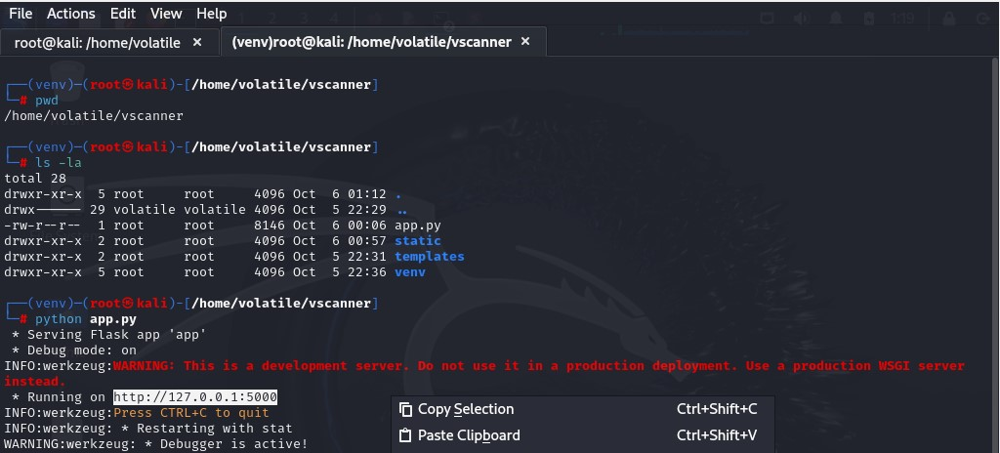
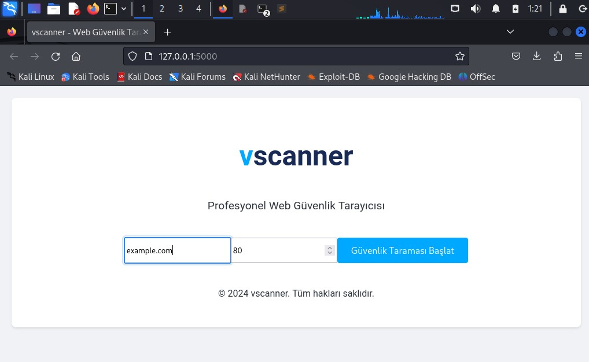
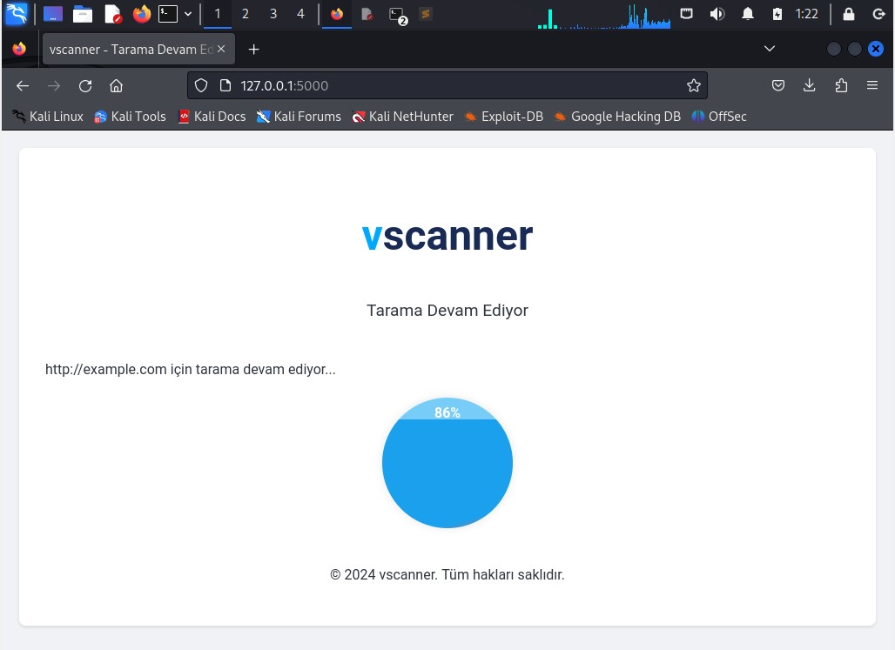
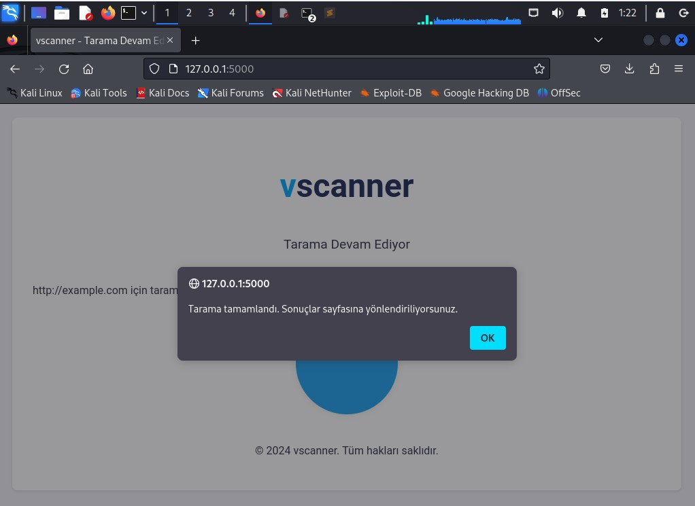
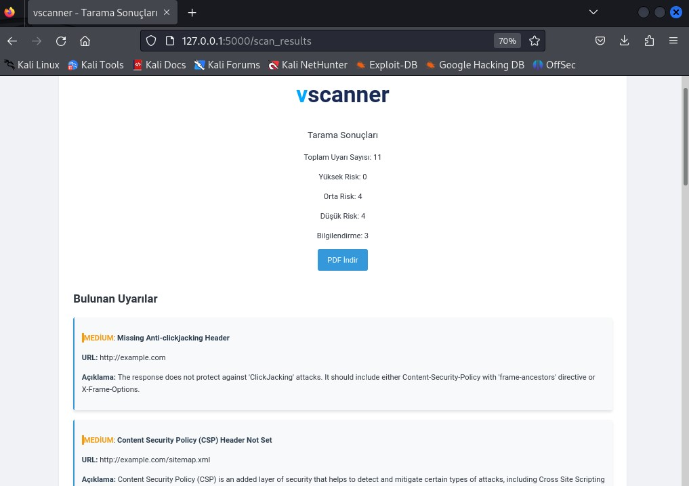

# vscanner


**vscanner**, web uygulamalarının güvenliğini test etmek için kullanılan yenilikçi bir araçtır. OWASP ZAP (Zed Attack Proxy) ile entegre çalışarak web sitelerini tarar ve güvenlik açıklarını raporlar. Güvenliğinizi bir adım öteye taşıyın!








---

## 🚀 Özellikler

- **🔍 Derinlemesine Tarama**: Belirtilen URL üzerinde kapsamlı güvenlik taraması yapın.
- **📊 Anlık İlerleme Takibi**: Tarama ilerlemesini gerçek zamanlı olarak izleyin.
- **📄 Detaylı PDF Raporları**: Tarama sonuçlarını PDF formatında indirilebilir rapor olarak alabilirsiniz.
- **⚠️ Risk Analizi**: Bulunan güvenlik açıklarını risk seviyelerine göre sınıflandırın.
- **🔒 Güvenli ve Hızlı**: Hızlı tarama yetenekleriyle güvenliğinizi artırın.

---

## 📥 Kurulum

### Gereksinimler

- **Python 3.x**: [Python İndir](https://www.python.org/downloads/)
- **OWASP ZAP**: [ZAP İndir](https://www.zaproxy.org/download/)
- **Pip**: Python paket yöneticisi

### Adımlar

1. **Proje Dosyalarını İndirin**:
   ```bash
   git clone https://github.com/kullanici/vscanner.git
   cd vscanner
   ```

2. **Sanal Ortam Oluşturun** (Önerilir):
   ```bash
   python -m venv venv
   source venv/bin/activate  # MacOS/Linux
   .\venv\Scripts\activate   # Windows
   ```

3. **Gerekli Python Paketlerini Yükleyin**:
   ```bash
   pip install Flask Flask-SocketIO requests reportlab zapv2
   ```

4. **OWASP ZAP'i Başlatın**:
   - ZAP'i başlatın ve API anahtarını alın:
     - ZAP arayüzünde, **Tools** > **Options** menüsüne gidin.
     - **API** sekmesine tıklayın ve API anahtarınızı not edin.
   - Aşağıdaki komutu kullanarak ZAP'i arka planda çalıştırın:
     ```bash
     /usr/share/zaproxy/zap.sh -daemon -host 0.0.0.0 -port 8080 -config api.key=YOUR_API_KEY
     ```
   - `YOUR_API_KEY` kısmını aldığınız API anahtarı ile değiştirin.

5. **Uygulamayı Başlatın**:
   ```bash
   python app.py
   ```

6. **Tarayıcıda Açın**:
   - `http://127.0.0.1:5000` adresine gidin.

---

## 🛠️ Kullanım

1. **Tarama Başlatın**:
   - URL ve port bilgilerini girerek taramayı başlatın.

2. **Sonuçları Görüntüleyin**:
   - Tarama tamamlandığında sonuçları ve PDF raporunu görüntüleyin.

---

## 📂 Dosya Yapısı

- **app.py**: Ana uygulama dosyası.
- **templates/**: HTML şablon dosyaları.
  - `index.html`: Ana sayfa.
  - `scanning.html`: Tarama ilerleme sayfası.
  - `results.html`: Tarama sonuçları sayfası.
- **static/**: Statik dosyalar (CSS ve JavaScript).
  - `style.css`: Stil dosyası.
  - `script.js`: İstemci tarafı JavaScript dosyası.

---

## 🤝 Katkıda Bulunma

Katkıda bulunmak isterseniz, lütfen bir pull request gönderin veya bir sorun bildirin. Her türlü katkı ve geri bildirim değerlidir!

---

## 📜 Lisans

Bu proje MIT Lisansı ile lisanslanmıştır. Daha fazla bilgi için `LICENSE` dosyasına bakın.

---

Web güvenliğinizi güçlendirin, vscanner ile korunun!
